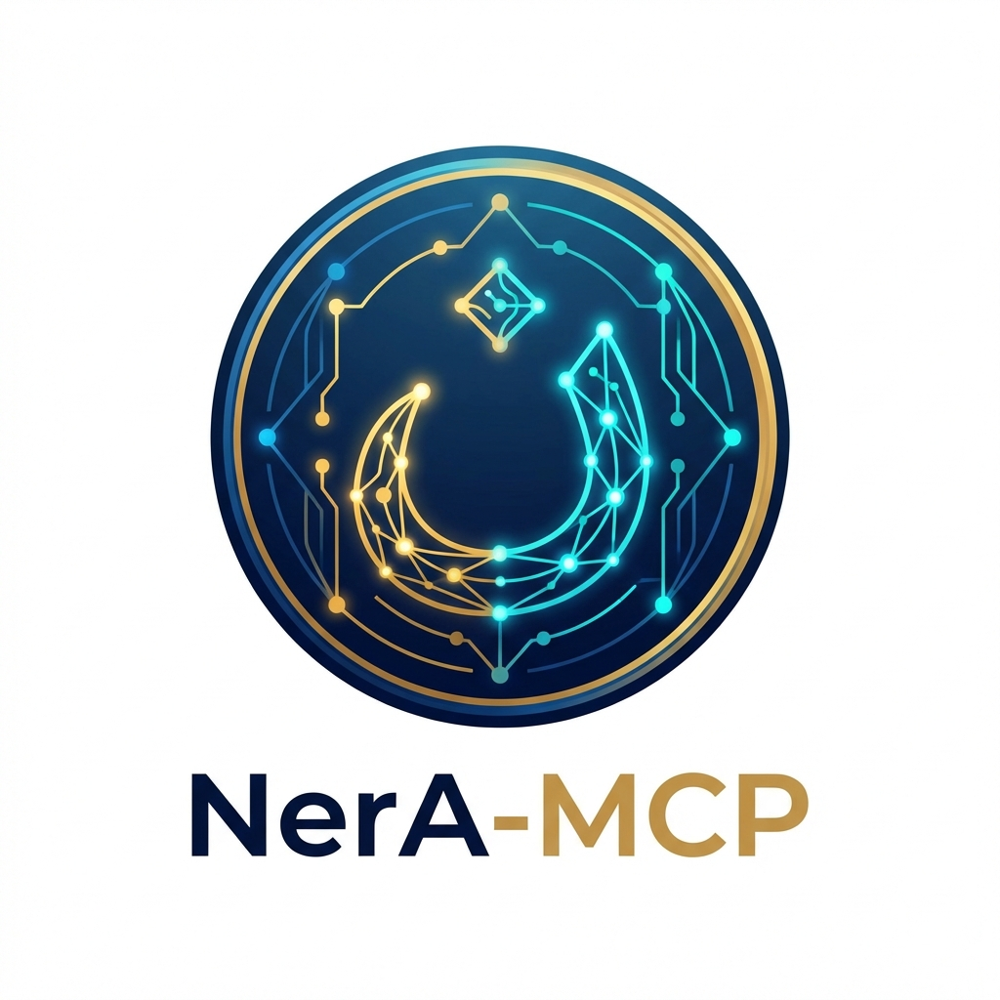
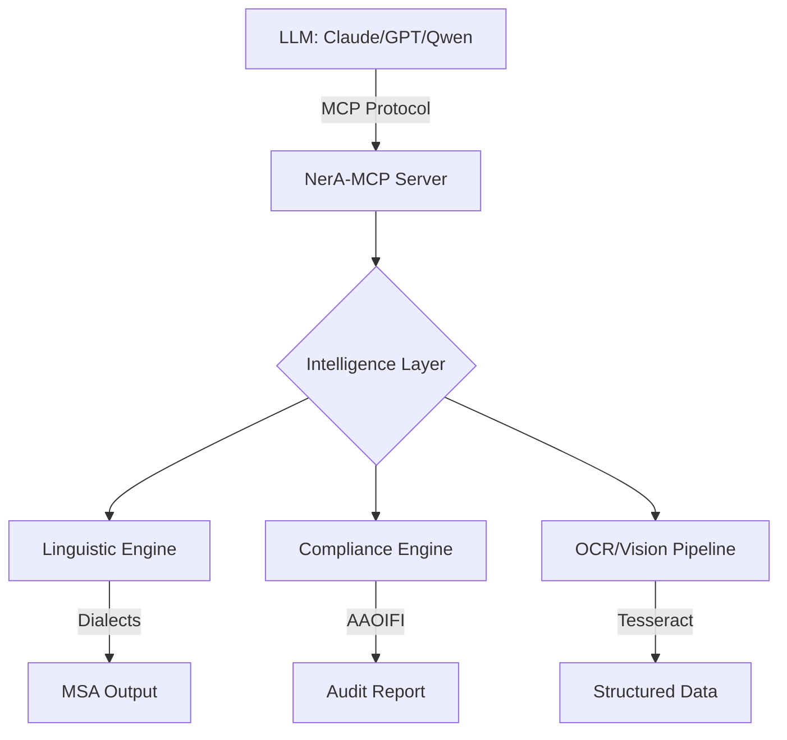

<div align="center">
  
</div>

# NerA-MCP: The Arabic Intelligence Layer


[](https://hub.docker.com/)
[](https://opensource.org/licenses/MIT)

**NerA-MCP** (Middle-East Network Architecture - Model Context Protocol) is a senior-engineered intelligence layer designed to bridge the gap between global Large Language Models (LLMs) and the complex linguistic, legal, and cultural nuances of the Arabic-speaking world.

---

## 🚀 Core Value Proposition

While global models have improved in basic Arabic processing, they consistently fail at mission-critical enterprise tasks in the MENA region. NerA-MCP provides:

*   **Linguistic Precision**: Native dialect normalization (Gulf, Egyptian, Levantine) to MSA.
*   **Enterprise Compliance**: Automated Sharia-compliance auditing and Hijri/Gregorian temporal synchronization.
*   **Information Integrity**: Credibility scoring for Arabic news and social media chains.
*   **Document Intelligence**: High-accuracy Arabic OCR with stamp and seal detection.

---

## 🛠 Features & Capabilities

### 🧠 Linguistic Intelligence
*   **Dialect Normalization**: Context-aware transformation of regional dialects into Modern Standard Arabic.
*   **Advanced Name Analysis**: intelligent parsing of compound Arabic names (e.g., merging "بن عبد الله") for KYC and legal matching.

### 🏛 Enterprise & Legal
*   **Sharia Compliance Engine**: Automated auditing of contracts against AAOIFI standards (Hanafi, Maliki, Hanbali schools).
*   **Temporal Engine**: Bi-directional Hijri-Gregorian conversion optimized for legal and government date systems.

### 📰 Information Trust
*   **News Credibility Scoring**: Analysis of clickbait markers, source reputation, and sensationalism in Arabic media.
*   **Document Extraction**: Robust OCR pipeline for scanned Iqamas, National IDs, and stamped certificates.

---

## 🏗 System Architecture



---

## 📦 Installation & Setup

### For Developers (Local Setup)

1.  **Environment Configuration**:
    ```bash
    conda create -y -n nera1 python=3.11
    conda activate nera1
    ```

2.  **Install Dependencies**:
    ```bash
    pip install .
    ```

3.  **Deploy System-level OCR (Optional)**:
    ```bash
    sudo apt-get install tesseract-ocr
    ```

### For Production (Docker)

NerA-MCP is fully containerized for reliable scaling:
```bash
docker-compose up --build -d
```

---

## 🔌 Integration

### Claude Desktop Configuration
Add the following to your `claude_desktop_config.json`:

```json
{
  "mcpServers": {
    "ner-a-mcp": {
      "command": "conda",
      "args": [
        "run",
        "--no-capture-output",
        "-n",
        "nera1",
        "python",
        "/home/mrazek/NerA/ner_a_mcp/server.py"
      ]
    }
  }
}
```

---

## 🌍 Distribution

### Publish to PyPI
This project is `pyproject.toml` compliant. To distribute:
1.  **Build**: `python -m build`
2.  **Upload**: `twine upload dist/*`

---

## 🛡 Security & Observability
*   **Logging**: Comprehensive logging via `sys.stdout` with standardized timestamps.
*   **Error Handling**: Robust exception shielding to ensure the MCP server remains resilient under high load.
*   **Auditability**: All tool invocations are logged for enterprise auditing.

---

## 🤝 Contributing
Contributions are welcome. Please ensure that all new tools include:
1.  Comprehensive docstrings.
2.  Input validation via Pydantic models.
3.  Integration tests in `test_tools.py`.

---

## 📜 License
Distributed under the **MIT License**. See `LICENSE` for more information.

---

<div align="center">
  Made with ❤️ for the Arabic AI Ecosystem
</div>
